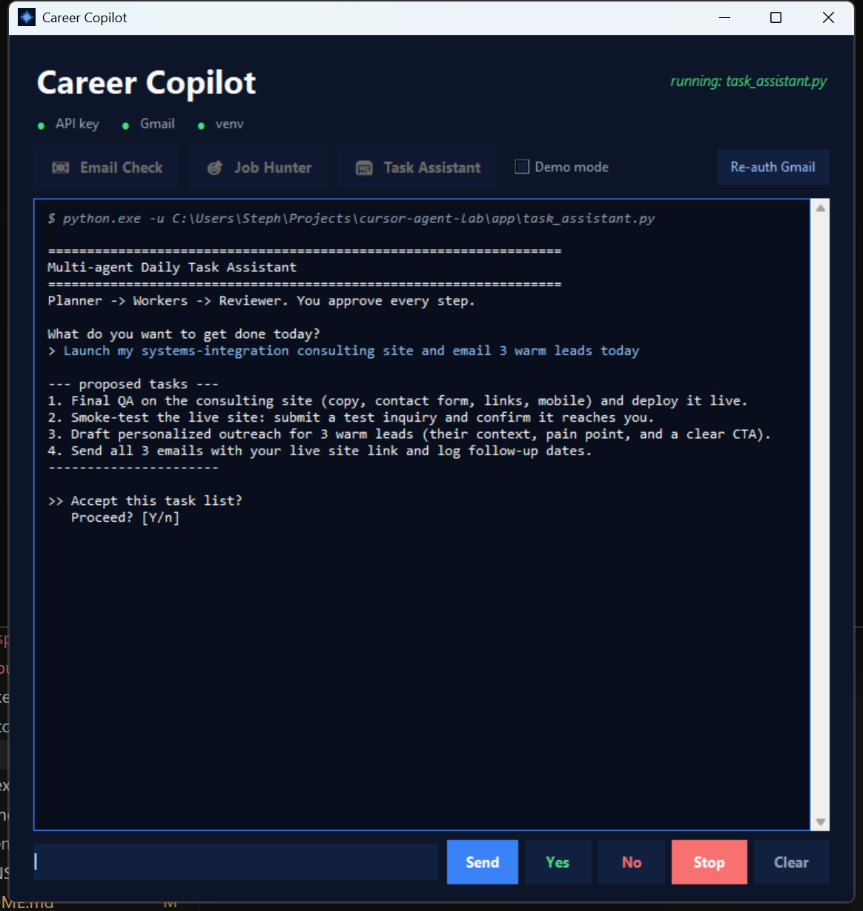

# Cursor Agent Lab

> Production-minded patterns for building **multi-agent, human-in-the-loop** automations on the
> [Cursor SDK](https://cursor.com/docs/sdk/python) — from first principles to a shippable desktop app.




*Career Copilot: one window that runs the toolkit's agents in an approval-gated, embedded console — no popup terminals. Styled to match [stephenv.net](https://stephenv.net).*

## What this demonstrates

A compact but complete showcase of the skills behind agent-driven workflow automation:

- **Multi-agent orchestration** — planner → workers → reviewer, coordinated from plain Python.
- **Human-in-the-loop control** — every agent action passes an `approve()` gate; nothing runs on its own.
- **Productization** — turning agent workflows into a **desktop app a non-coder can use** (Tkinter, embedded console, live stdin/stdout streaming).
- **Real integrations** — Gmail API, live web search, and **MCP** tool servers.
- **Debugging the stack** — diagnosed and fixed a real **Cursor SDK crash on Windows** (root cause + shim documented [below](#known-sdk-issue-on-windows-diagnosed--fixed-here)).

> Built by **Stephen Vowell** — available for AI-workflow automation & systems-integration work.
> [github.com/stephenvowell](https://github.com/stephenvowell) · [stephenv.net](https://stephenv.net)

## The core design: you stay in control

Nothing here runs autonomously. Every agent action passes through an
approval gate (`approve()` in `shared/`), so *you* decide what happens and
when. That's the whole point: learn the machinery while keeping your hands
on the wheel.

## What you'll learn

| Lesson | File | Concept |
|--------|------|---------|
| 1 | `lessons/01_one_shot.py` | One agent, one shot — `Agent.prompt(...)` |
| 2 | `lessons/02_streaming_followup.py` | A durable agent, streaming output + follow-ups — `Agent.create` / `agent.send` |
| 3 | `lessons/03_human_in_the_loop.py` | The approval-gate pattern: agent proposes, you approve/deny/edit |
| 4 | `lessons/04_multi_agent_orchestration.py` | **Multiple agents** working together: planner → workers → reviewer |

Then the capstones:

- `app/task_assistant.py` — an interactive **multi-agent daily-task assistant**.
  You give it a goal; a *planner* agent proposes tasks (you approve/edit),
  *worker* agents draft each one (you approve, optionally save), and a
  *reviewer* agent wraps up. Multiple agents, human-in-the-loop throughout.
- `app/job_hunter.py` — **Job Scout + hunter pipeline**. *Job Scout* searches live
  boards (Interrupt, Arc, Wellfound, …) and returns a scored markdown table;
  *matcher* agents score each role against your résumé (APPLY/MAYBE/SKIP), a
  *ranker* shortlists the best, and a *writer* drafts cover letters — you
  approve every step (yes/no in Career Copilot). Profile:
  `workspace/output/resume-and-cover-letter.md`. Scout report:
  `workspace/output/jobs-YYYY-MM-DD.md`.

## Prerequisites

- **Python 3.9+**
- A **Cursor API key** — create one at
  [cursor.com/dashboard/integrations](https://cursor.com/dashboard/integrations).

## Setup

```powershell
# from the project folder
python -m venv .venv
.\.venv\Scripts\Activate.ps1        # PowerShell
pip install -r requirements.txt

# add your key
copy .env.example .env              # then edit .env and paste your key
# ...or set it for the session:
$env:CURSOR_API_KEY = "cursor_your_key_here"
```

## Run

```powershell
python lessons/01_one_shot.py
python lessons/02_streaming_followup.py
python lessons/03_human_in_the_loop.py
python lessons/04_multi_agent_orchestration.py

python app/task_assistant.py
python app/job_hunter.py
```

Each script prints what it's *about* to do and waits for your `y`/`n`.
Answer `n` and nothing is sent.

### Try it with no API key: demo mode

Add `--demo` (or set `CURSOR_LAB_DEMO=1`) to run any lesson or the app with
**fake agents** — same interaction, approval gates, and file output, but no key
and no cost. Great for seeing the flow before you wire up a real key.

```powershell
python app/task_assistant.py --demo
python lessons/04_multi_agent_orchestration.py --demo
```

The banner shows `[DEMO]` so you always know which mode you're in.

## The "not autonomous" design

- **`approve()` gates every send.** The agents never act until you say yes.
- **Local runtime, sandboxed `cwd`.** Agents run against the `workspace/`
  folder, not your real projects, so experiments stay contained.
- **Drafts, not actions.** The task assistant produces text you review;
  saving output is a separate, explicit approval.

## Known SDK issue on Windows (diagnosed + fixed here)

`cursor-sdk` 0.1.8's **sync local runtime crashes on Windows** before an agent
can start. This repo diagnoses the root cause and ships an automatic,
zero-config workaround so every lesson runs on Windows out of the box.

**Symptom**

```
OSError: [WinError 10038] An operation was attempted on something that is not a socket
```

**Root cause**

The bridge-discovery step (`cursor_sdk/_bridge.py`) reads the agent subprocess's
`stderr` pipe with `select.select()`. On Windows, `select()` only supports
sockets — not file handles or pipes — so it raises `WinError 10038`. The SDK's
**async** path works because it uses `asyncio` stream readers instead.

**Fix (in `shared/__init__.py`)**

At import time, `shared/` monkeypatches `_bridge._read_discovery` to read the
discovery line on a background thread (blocking `readline` with a timeout)
instead of `select()`. This mirrors what the async path already does. The shim
is a **no-op on macOS/Linux and on the async runtime** — nothing for you to
configure; it just makes the sync local runtime start normally on Windows.

> Reported upstream to Cursor. Suggested upstream fix: on Windows, use a
> thread-based stderr reader in `_read_discovery` rather than `select()`.

## Key SDK concepts (cheat sheet)

- `Agent.prompt(prompt, options)` — one-shot; sends, waits, disposes itself.
- `Agent.create(...)` + `agent.send(...)` — durable agent with streaming and
  multi-turn follow-ups. Always `run.wait()`; dispose with `with ... as agent:`.
- `Agent.resume(id, ...)` — pick an existing agent back up later.
- Two failure modes: a thrown `CursorAgentError` = the run never started
  (auth/config/network); a returned `result.status == "error"` = it ran and
  failed. Handle them differently.

See the [Python SDK docs](https://cursor.com/docs/sdk/python) for the full reference.

## Layout

```
cursor-agent-lab/
├─ README.md
├─ requirements.txt
├─ .env.example
├─ shared/__init__.py        # api-key check, approval gate, streaming helper
├─ lessons/                  # progressive, runnable examples
│  ├─ 01_one_shot.py
│  ├─ 02_streaming_followup.py
│  ├─ 03_human_in_the_loop.py
│  └─ 04_multi_agent_orchestration.py
├─ app/
│  ├─ task_assistant.py      # multi-agent capstone (planner/worker/reviewer)
│  └─ job_hunter.py          # web-search scout -> matchers -> ranker -> cover letters
└─ workspace/                # sandbox the agents run against (gitignored output)
```

## Author & license

Built by **Stephen Vowell** ([github.com/stephenvowell](https://github.com/stephenvowell)).
Licensed under the [MIT License](LICENSE).
